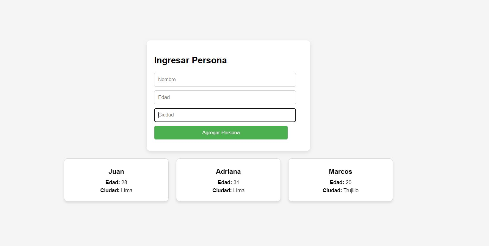

# ToDo JS : Crear un formulario donde se pueda ingresar información de una persona y por cada una de ellas mostrarlo en una carta/tarjeta/card de forma dinámica, el diseño es libre. Además Se requiere que las personas se almacenen en un array de objetos y mostrar todo el array en la consola.

1) Formulario: Hay un formulario simple con tres campos: nombre, edad y ciudad. Cuando el formulario se envía, se llama a un evento de JavaScript.

2) Contenedor de tarjetas: Las tarjetas de las personas se mostrarán aquí. Se utiliza el ```id="cardsContainer"``` para hacer referencia a este contenedor en JavaScript.

3) En el Javascript he creado un Array personas: Este array almacenará la información de todas las personas ingresadas.

4) crearTarjeta(persona): Esta función toma un objeto persona y crea una tarjeta HTML con su información. Luego devuelve la tarjeta para agregarla al DOM.

5) Formulario (submit event): Cuando el formulario se envía:
- Se obtienen los valores de los campos.
- Se crea un objeto persona con esos valores.
- El objeto persona se agrega al array personas.
- Se muestra una tarjeta con la información de la persona en la página.
- Se limpia el formulario.
- Se muestra todo el array de personas en la consola.


